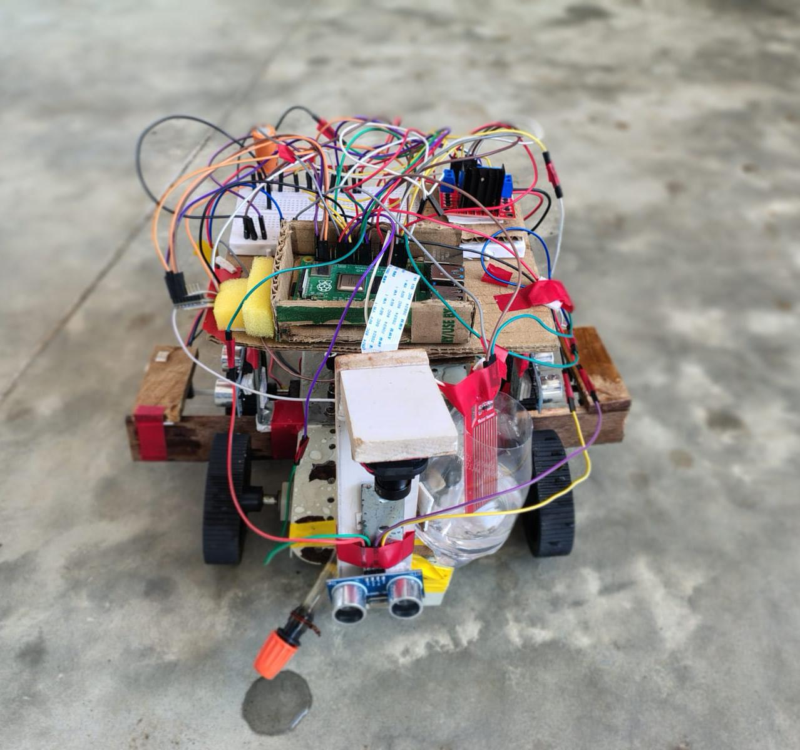
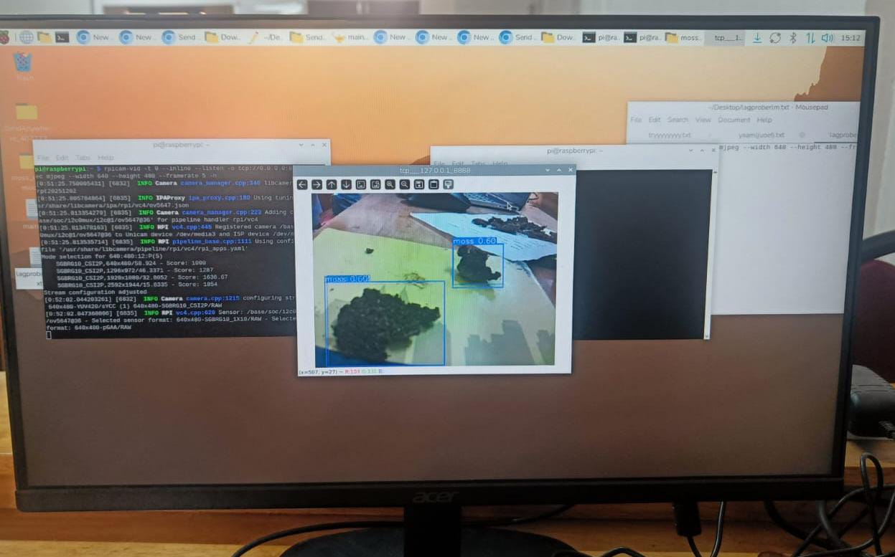
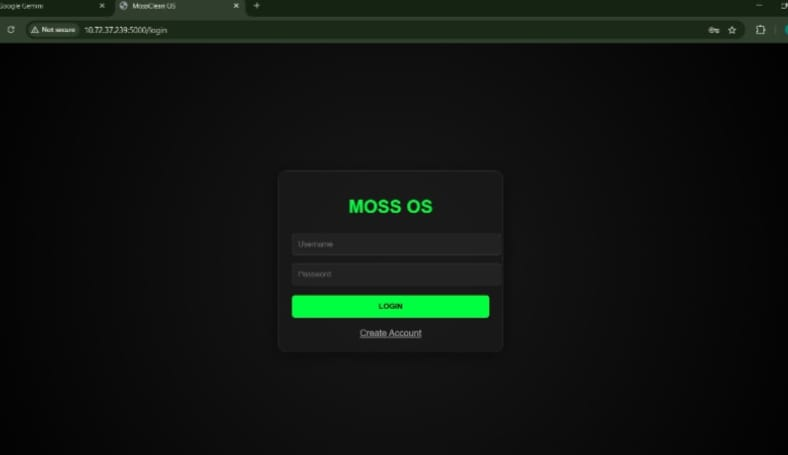
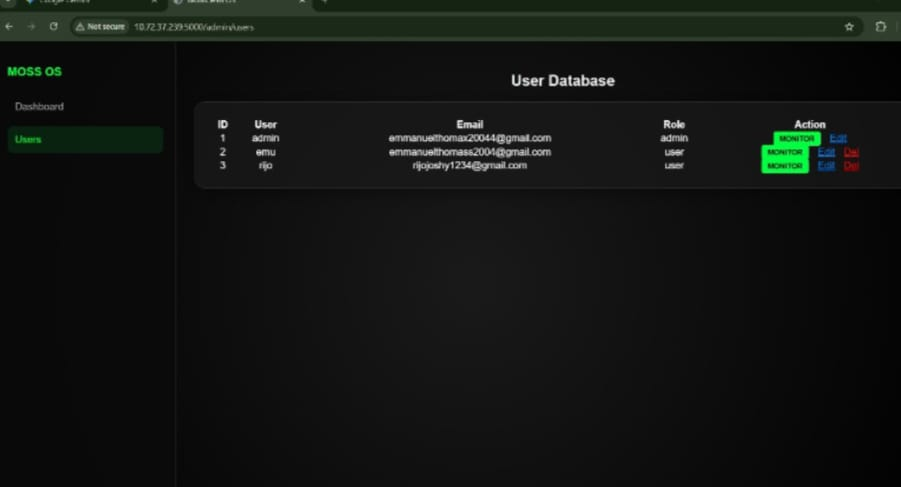
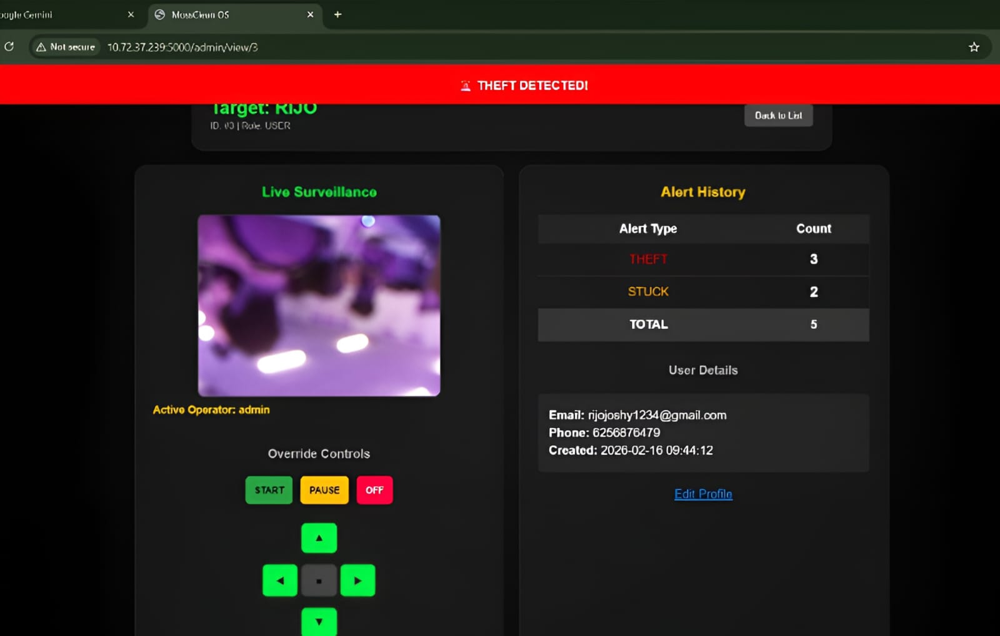

# MossClean

### An Autonomous Surface Cleaning Robot with Smart Detection and Web-Based Monitoring

> **Edge AI • Autonomous Navigation • Precision Cleaning • IoT Monitoring**

MossClean is an autonomous mobile robotic platform designed to identify moss on paved surfaces, navigate without GPS, apply targeted cleaning solution, and provide remote monitoring and control through a web interface.

---

## ✨ Project at a Glance

| **Layer** | **Implementation** |
|---|---|
| Edge Computer | Raspberry Pi 4 Model B (4 GB) |
| Vision | OV5647 5 MP camera |
| AI Detection | YOLOv11n / Nano object detection |
| Image Processing | OpenCV |
| Navigation | GPS-independent dead reckoning + occupancy grid |
| Motion Control | Proportional heading correction + differential PWM |
| Coverage | Boustrophedon / lawnmower sweep |
| Path Planning | A* frontier recovery |
| Obstacle Safety | 4× HC-SR04 ultrasonic sensors |
| Odometry | LM393 optical encoders |
| Orientation | MPU-6050 gyroscope/accelerometer |
| Actuation | DC gear motors + L298N |
| Cleaning | 12 V diaphragm pump + relay |
| Monitoring | Flask web dashboard + live telemetry |
| Alerts | SMTP anomaly/security notifications |

---

## 🧠 System Architecture

```text
                    ┌───────────────────────────┐
                    │       MossClean Robot      │
                    └─────────────┬─────────────┘
                                  │
                   ┌──────────────┼──────────────┐
                   │              │              │
                   ▼              ▼              ▼
            ┌────────────┐ ┌────────────┐ ┌─────────────┐
            │ OV5647     │ │ Ultrasonic │ │ IMU +       │
            │ Camera     │ │ Sensors    │ │ Encoders    │
            └─────┬──────┘ └─────┬──────┘ └──────┬──────┘
                  │              │               │
                  ▼              ▼               ▼
            ┌────────────┐ ┌────────────────────────────┐
            │ YOLOv11n   │ │ World Model + Odometry     │
            │ Moss AI    │ │ Occupancy Grid + Safety    │
            └─────┬──────┘ └─────────────┬──────────────┘
                  │                      │
                  └──────────┬───────────┘
                             ▼
                    ┌────────────────────┐
                    │ Raspberry Pi       │
                    │ Control Layer      │
                    └─────────┬──────────┘
                              │
                  ┌───────────┼─────────────┐
                  ▼           ▼             ▼
            ┌──────────┐ ┌───────────┐ ┌──────────────┐
            │ Motors   │ │ Pump/Relay│ │ Telemetry    │
            │ + L298N  │ │ Sprayer   │ │ + Alerts     │
            └──────────┘ └───────────┘ └──────┬───────┘
                                              ▼
                                     ┌──────────────────┐
                                     │ MossClean Web OS │
                                     │ Monitor / Control│
                                     └──────────────────┘
```

The implementation keeps camera/YOLO/pump functionality inside the MossController, separated from navigation, world-model and sensor-polling components.

---

## 🚀 Core Intelligence

### 1. Moss Detection

The camera captures frames and the YOLO model performs inference using a configurable confidence threshold. A detected moss patch is saved as an annotated image and can trigger the spray sequence. The current implementation uses a 0.60 confidence threshold and a 640×640 inference image size.

### 2. Autonomous Coverage

MossClean uses a deterministic lawnmower-style coverage pattern to systematically traverse the operating area rather than relying on random movement.

### 3. GPS-Free Navigation

Wheel encoder ticks and IMU yaw are used to estimate robot position and heading. Sensor observations are projected into a 2D grid to maintain environmental knowledge.

### 4. Obstacle Avoidance

Four ultrasonic sensors provide directional distance information. The navigation layer can stop, evaluate lateral clearance, bypass an obstacle, and resume its coverage path.

### 5. Precision Spray Actuation

When moss is detected, the robot stops and activates the pump for the configured spray duration before resuming navigation.

### 6. Web Monitoring & Security

The project includes a Flask-based command center with live video, telemetry, role-based access control and SMTP alerts for events such as theft or a stuck condition.

---

## 📊 AI Validation Snapshot

The project report records the following YOLOv11n validation results:

- **Precision:** 64.6%
- **Recall:** 56.9%
- **mAP@50:** 58.8%
- **Configured live confidence threshold:** 60%
- **Reported Raspberry Pi inference:** approximately 130–160 ms/frame

These figures are reported as proof-of-concept validation results in the project report.

---

## 📁 Repository Structure

```text
MossClean/
├── README.md
├── LICENSE
├── .gitignore
├── .env.example
├── CHANGELOG.md
├── CONTRIBUTING.md
├── SECURITY.md
├── mossclean-robot.jpeg
├── mossclean-ai-detection.jpeg
├── config/
│   └── README.md
├── docs/
├── src/
│   ├── README.md
│   └── mossclean_robot.py
├── templates/
└── web/
    ├── README.md
    ├── mossclean_server.py
    ├── static/
    │   ├── css/
    │   └── images/
    │       ├── .gitkeep
    │       ├── mossclean-login-screen.jpeg
    │       ├── mossclean-user-database.jpeg
    │       └── mossclean-user-monitoring.jpeg
    └── templates/
```

---

## 🛠️ Raspberry Pi Setup

The main control program is intended for Raspberry Pi hardware and imports GPIO, OpenCV, SMBus, gpiozero, Picamera2 and Ultralytics YOLO components.

```bash
git clone <YOUR_REPOSITORY_URL>
cd MossClean

python3 -m venv .venv
source .venv/bin/activate
pip install -r requirements-pi.txt

python3 src/mossclean_robot.py
```

> **Hardware warning:** This program directly controls motors, GPIO pins, sensors and a pump. Do not execute it on a normal PC or connected hardware without reviewing the pin map and safety conditions.

---

## 🔌 Hardware Pin Highlights

The implementation defines four ultrasonic sensor channels, two PWM motor channels, motor direction pins, encoder inputs, IMU communication and the pump relay in its configuration layer. The pump relay is assigned to **BCM GPIO 4 / physical pin 7**.

---

## 🔐 Security & Secrets

**Never commit:**

- SMTP passwords
- API keys
- Wi-Fi passwords
- database credentials
- private model artifacts containing sensitive data
- `.env` files
- personal credentials

Use environment variables or a local `.env` file that is excluded by `.gitignore`.

Before making this repository public, review the included project report/presentation for personal contact information and institutional material.

---

## 📸 Prototype & Dashboard

### Physical Prototype



### Real-Time Moss Detection



### MossClean OS — Login



### MossClean OS — User Management



### MossClean OS — Monitoring Dashboard



---

## 🎯 Project Objectives

1. Detect moss using edge AI.
2. Navigate autonomously without GPS.
3. Systematically cover the target surface.
4. Avoid obstacles in real time.
5. Apply cleaning solution only after a positive detection.
6. Provide live remote monitoring and control.
7. Detect operational/security anomalies and generate alerts.

The project report frames MossClean as a scalable autonomous surface-maintenance platform combining computer vision, GPS-independent navigation, targeted spraying and IoT monitoring.

---

## 🔭 Future Roadmap

The project documentation identifies several future upgrades:

- Solar-assisted operation to extend runtime.
- LiDAR/SLAM for high-definition mapping.
- Variable-rate chemical application based on moss density.
- Automated docking and self-charging.
- Multi-robot coordination through IoT mesh networks.

---

## 👥 Team

**MossClean — SJCET Palai**

- Abhishek N B
- Emmanuel Thomas
- Hari Govind S
- Rijo Joshy

---

## 📄 Documentation

The complete project documentation is maintained under `docs/`.

---

## ⭐ Why MossClean?

MossClean brings together **robotics + edge AI + autonomous navigation + targeted actuation + IoT monitoring** into one integrated prototype.

The goal is not simply to build a cleaning rover, but to demonstrate a complete edge-intelligent robotic workflow:

**Perception → Decision → Navigation → Actuation → Monitoring**

---

## 📜 License

Released under the MIT License. See `LICENSE`.
